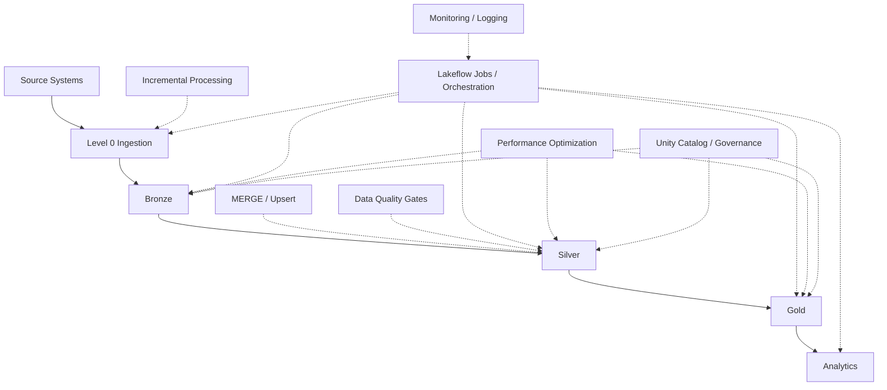

# FinFlow Architecture

## Core Data Flow



## Databricks Workflow

```text
level_0_ingestion [SQL Query]
        ↓
bronze_processing [Notebook]
        ↓
silver_processing [Notebook]
        ↓
gold_processing [Notebook]
        ↓
analytics_processing [Notebook]
```

## Layer Responsibilities

| Layer | Main responsibility |
|---|---|
| Level 0 | Initial ingestion and source inspection |
| Bronze | Preserve incoming data and profile quality |
| Silver | Clean, standardize, validate and deduplicate |
| Gold | Create business-oriented datasets |
| Analytics | Answer business questions |
| Engineering | Operationalize and productionize the pipeline |
